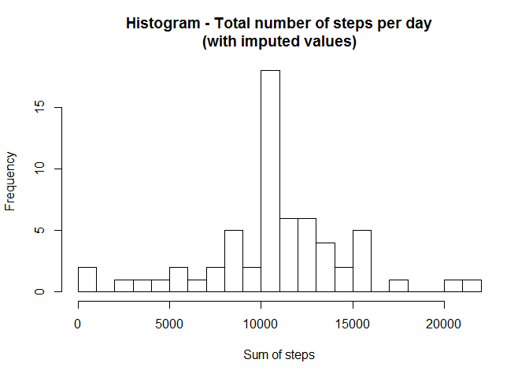

# Reproducible Research: Peer Assessment 1

## Introduction

It is now possible to collect a large amount of data about personal
movement using activity monitoring devices such as a
[Fitbit](http://www.fitbit.com), [NikeFuelband](http://www.nike.com/us/en_us/c/nikeplus-fuelband), or [Jawbone Up](https://jawbone.com/up). These devices are part of
the "quantified self" movement -- a group of enthusiasts who take
measurements about themselves regularly to improve their health, to
find patterns in their behavior, or because they are tech geeks. 

However, the data collected remain under-utilized, both because the raw data are hard to
obtain and because there is a lack of statistical methods and software for processing and interpreting the data. This report will show how the [statistical software package **R**](http://www.r-project.org/) can be used for performing some basic statistical analysis of personal movement data.

The data used in this analysis comes from a personal activity monitoring
device that records data at 5-minute intervals throughout the
day. The dataset consists of observations from an anonymous
individual collected during the months of October and November, 2012
and includes the number of steps taken in 5-minute intervals each day.

## Loading and preprocessing the data

The dataset is stored in a CSV file (Comma Separated Values), and we are given the information that the variables included in the dataset are:

* **steps**: Number of steps taking in a 5-minute interval (missing
    values are coded as `NA`)

* **date**: The date on which the measurement was taken in YYYY-MM-DD
    format.

* **interval**: Identifier for the 5-minute interval in which
    measurement was taken.

Using the `data.table` library, we load the data, and keep the dates as `character` instead of having them converted to `factors`:

```r
library("data.table")
```

```r
activity_dt <- data.table(read.csv(file = "./data/activity.csv", 
                                   stringsAsFactors=FALSE))
```

The total number of observations in the loaded dataset is:

```
## [1] 17568
```
which corresponds with the reported size of the dataset.

We can use R's `summary` function to get an overview of the types and value ranges of the variables:

```r
summary(activity_dt)
```

```
##      steps            date              interval     
##  Min.   :  0.00   Length:17568       Min.   :   0.0  
##  1st Qu.:  0.00   Class :character   1st Qu.: 588.8  
##  Median :  0.00   Mode  :character   Median :1177.5  
##  Mean   : 37.38                      Mean   :1177.5  
##  3rd Qu.: 12.00                      3rd Qu.:1766.2  
##  Max.   :806.00                      Max.   :2355.0  
##  NA's   :2304
```
We note that the `steps` varialbe contains `NA` values. We will have to take this into account when we perform further calculations.

# Analysis

## What is mean total number of steps taken per day?
Some of the first questions that come to mind when thinking about the daily activity of a person are:

* _How many steps_ did they take every day?

* What was the _average_ number of steps per day?

* What was the _median_?

The `dplyr` library provides a convenient way of performing this type of calculations. 

```r
library("dplyr")
```
### Total number of steps taken per day
Group the records by `date` and calculate the sum of steps per day:

```r
sumSteps <- activity_dt %>%
    group_by(date) %>%
    summarise(steps=sum(steps))
```

We can now draw a [histogram](http://en.wikipedia.org/wiki/Histogram) of the total number of steps taken per day:

```r
hist(sumSteps$steps, 
     breaks=20, 
     xlab="Sum of steps",
     main="Histogram - Total number of steps per day")
```

 

From the graphic we can deduce that the most frequent values are in the region of 10 to 11 thousand steps per day.

###  Mean and median
Not surprisingly, the intuitive graphical solution corresponds with the calculation of the **mean**:


```r
mean(sumSteps$steps, na.rm=TRUE)
```

```
## [1] 10766.19
```

and the **median**:

```r
median(sumSteps$steps, na.rm=TRUE)
```

```
## [1] 10765
```

Note that the missing values in the dataset were ignored in the previous calculations, as we used the option `na.rm=TRUE`, which instructs **R** to _remove_ the `NA` values.

## What is the average daily activity pattern?
We now turn our attention to the patterns of activity during the day. We want to plot the average number of steps taken during each 5-minute interval, but averaged across all days.

We start by calculating the average number of steps per interval --again ignoring the missing values.


```r
meanStepsInterval <- activity_dt %>%
    group_by(interval) %>%
    summarise(steps=sum(steps, na.rm=TRUE)) %>%
    mutate(mean.steps.interval =round(steps / nrow(sumSteps),1))  %>%
    select(interval, mean.steps.interval)
```

And now we are ready to draw the graph:


```r
plot(meanStepsInterval$interval, meanStepsInterval$mean.steps.interval,
     type="l",
     axes = FALSE,
     xlab="Time",
     ylab="Average number of steps",
     main="Pattern of daily activity")
axis(1,at=c(0,300,600,900,1200,1500,1800,2100,2400), 
     labels=c("00:00", "03:00","06:00","09:00","12:00",
              "15:00","18:00","21:00","24:00") )
axis(side = 2, las = 1)
```

 

The highest activity seems to happen somewhat before 9 AM. The highest average number of steps is:

```r
summarize(meanStepsInterval, maxSteps= max(mean.steps.interval))
```

```
## Source: local data table [1 x 1]
## 
##   maxSteps
## 1    179.1
```
and it happens at this interval:

```r
filter(meanStepsInterval, mean.steps.interval==179.1)
```

```
## Source: local data table [1 x 2]
## 
##   interval mean.steps.interval
## 1      835               179.1
```
which is 8:35 AM. That can be the time this person goes to work or to school/ college.

## Imputing missing values
When we produced the summary of the loaded data, at the begining of this analisys, we found that there were 2304 missing values:

`##      steps`  

`##  NA's   :2304`

If we wanted to calculate the number directly, we could do so by counting the number of rows for which the reported number of steps is `NA`: 

```r
nrow(activity_dt[is.na(activity_dt$steps)==TRUE,]) 
```

```
## [1] 2304
```

This corresponds with eight days for which no observations were recorded:

```r
sumSteps[is.na(sumSteps$steps),]
```

```
## Source: local data table [8 x 2]
## 
##         date steps
## 1 2012-10-01    NA
## 2 2012-10-08    NA
## 3 2012-11-01    NA
## 4 2012-11-04    NA
## 5 2012-11-09    NA
## 6 2012-11-10    NA
## 7 2012-11-14    NA
## 8 2012-11-30    NA
```

The presence of missing dates may introduce bias in to some calculations of summaries of data. We will try to fill in all the missing values in the dataset by replacing the `NA` with the average number of steps for the same interval over all days. 

We will use the `reshape2` library to create new columns for each interval; this will allow us to calculate the average number of steps in each column/ interval.


```r
library(reshape2)
```

```r
act_dt <- dcast(activity_dt,date ~ interval, value.var="steps")
```

Here are the first rows and columns of the reshaped dataset:

```r
act_dt[1:5,1:15]
```

```
##         date  0  5 10 15 20 25 30 35 40 45 50 55 100 105
## 1 2012-10-01 NA NA NA NA NA NA NA NA NA NA NA NA  NA  NA
## 2 2012-10-02  0  0  0  0  0  0  0  0  0  0  0  0   0   0
## 3 2012-10-03  0  0  0  0  0  0  0  0  0  0  0  0   0   0
## 4 2012-10-04 47  0  0  0  0  0  0  0  0  0  0  0   0   0
## 5 2012-10-05  0  0  0  0  0  0  0  0  0  0  0  0   0   0
```

Now we construct a function that will substitute missing values(`NA`) by the mean and apply this function to the dataset:


```r
mean.steps <- function(a) {
    a[is.na(a)] <- round(mean(a, na.rm=TRUE),0)
    a
}

steps <- apply(act_dt[,2:ncol(act_dt)], 2, mean.steps)
```
The result is a list of 2 dimensions with the mean value per interval.

We can then create another list with the dates and we bind both lists together.


```r
dates <- as.character(act_dt[,1])
actimp <- cbind.data.frame(dates,steps)
```

As a final step, we _melt_  the dataset to return it to the long form or the original dataset and we assign the same column names as in the original.


```r
actImp <- melt(actimp)

setnames(actImp,1:ncol(actImp), c("date","interval","steps" ))
```

We proceed to calculate the daily averages as before:

```r
sumSteps2 <- actImp %>%
    group_by(date) %>%
    summarise(steps=sum(steps))
```

And we plot the histogram:


```r
hist(sumSteps2$steps, 
     breaks=20, 
     xlab="Sum of steps",
     main="Histogram - Total number of steps per day\n(with imputed values)",
     )
```

 

After replacing the missing values by the mean, we observe that the frequencies around the median have increased, while the frequencies in the extreme ends have decreased.

When we calculate mean and median of the new dataset we observe only very minor changes with the previous values:

```r
mean(sumSteps2$steps)
```

```
## [1] 10765.64
```


```r
median(sumSteps2$steps)
```

```
## [1] 10762
```

## Are there differences in activity patterns between weekdays and weekends?

For the final part of this report we will investigate how the activity patterns vary between weekdays and weekends. 

We start by identifying which of the days in our data fall into each of the two categories. 

```r
actImp$wday <- ifelse(weekdays(as.Date(actImp$date)) %in% 
                              c("Saturday", "Sunday"), "weekend", "weekday")
```

Then we calculate the total number of steps per 5-minute interval and type of day:

```r
actImpWday <- dcast(actImp, wday ~ interval, 
                                 fun.aggregate = sum, value.var="steps")
actImpWday2 <- melt(actImpWday)

#set the column names
setnames(actImpWday2,1:3,c("wday","interval","steps"))
```

As a last step we calculate the mean; in order to do that we need to compute the number of days that fall in the working week and in the weekend.


```r
sumSteps$wday <- ifelse(weekdays(as.Date(sumSteps$date)) %in% 
                              c("Saturday", "Sunday"), "weekend", "weekday")

weekdayMean <- actImpWday2 %>%
    filter(wday=="weekday") %>%
    mutate(meanSteps =round(steps / nrow(filter(sumSteps,wday=="weekday")),1))  %>%
    select(wday, interval, meanSteps)
    
weekendMean <- actImpWday2 %>%
    filter(wday=="weekend") %>%
    mutate(meanSteps =round(steps / nrow(filter(sumSteps,wday=="weekend")),1))  %>%
    select(wday, interval, meanSteps)

wdaySteps <- rbind(weekdayMean,weekendMean)
```

We will be using the `ggplot2` library to draw the panel plot:

```r
library(ggplot2)
library("grid")
```


```r
ggplot(data = wdaySteps, aes(x=interval, y=meanSteps, group = 1)) +
    geom_line() +
    scale_x_discrete(breaks=c(0,300,600,900,1200,1500,1800,2100,2400), 
     labels=c("00:00", "03:00","06:00","09:00","12:00",
              "15:00","18:00","21:00","24:00") ) +
    theme(panel.grid.minor = element_blank()) +
    facet_grid(wday ~ .) +
    theme_bw() +
    theme(plot.title=element_text(vjust=2)) +
    theme(axis.title.x = element_blank()) +
    theme(axis.title.y = element_blank()) +
    theme(plot.title=element_text(vjust=2)) +
    labs(title="Pattern of daily activity - Average steps per 5-minute interval")
```

 

The panel plot strongly suggests that the anonymous subject of this analysis is much less active during the weekends that during the normal working week.
                      
